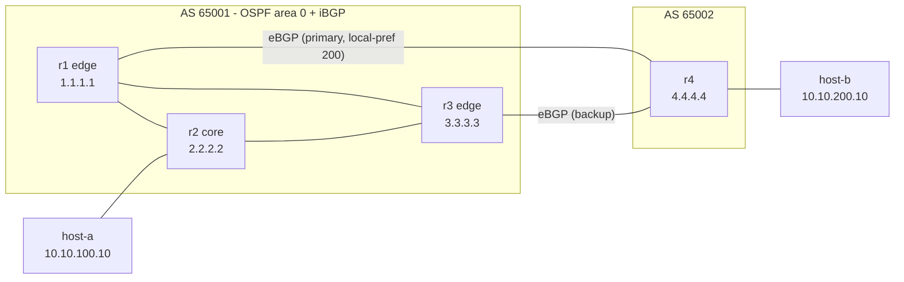
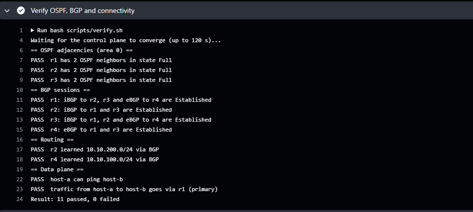
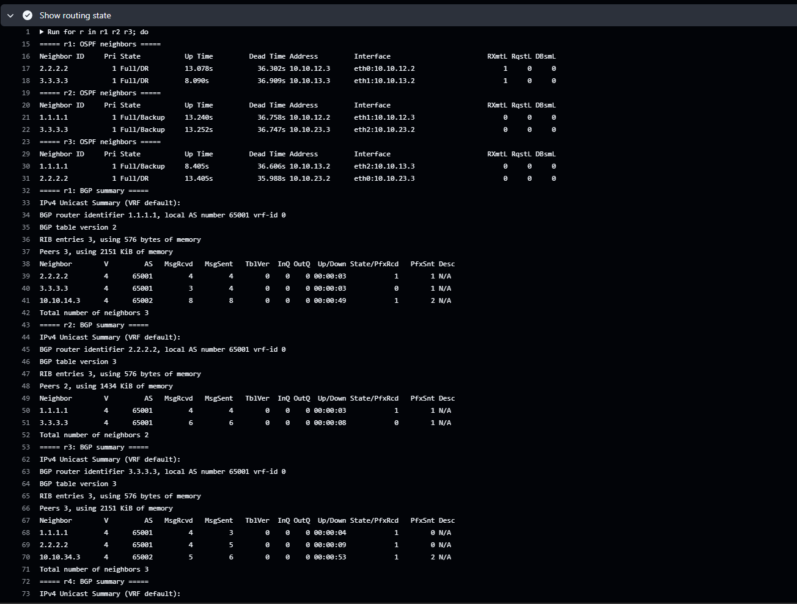
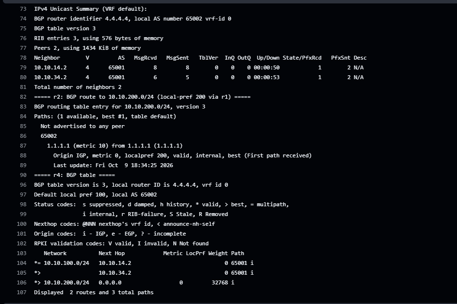
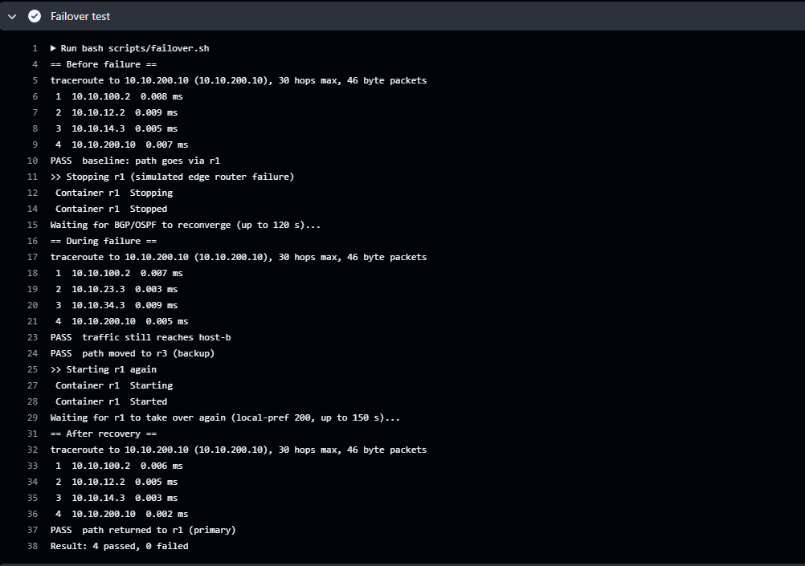

# OSPF + BGP Routing Lab

[](https://github.com/adankhalid0/ospf-bgp-routing-lab/actions/workflows/ci.yml)

A small routing lab built with [FRRouting](https://frrouting.org/) and Docker
Compose. Four routers form a simulated service-provider setup: an internal
network running **OSPF**, connected to an external network over **eBGP**, with
a redundant path that takes over when the primary edge router fails.

It is built to practice the day-to-day work of a network engineer: reading
routing tables, checking protocol adjacencies, troubleshooting, and verifying
failover.

## Topology



| Link | Subnet | Routers |
|------|--------|---------|
| r1 - r2 | 10.10.12.0/24 | r1 .2, r2 .3 |
| r1 - r3 | 10.10.13.0/24 | r1 .2, r3 .3 |
| r2 - r3 | 10.10.23.0/24 | r2 .2, r3 .3 |
| r1 - r4 | 10.10.14.0/24 | r1 .2, r4 .3 |
| r3 - r4 | 10.10.34.0/24 | r3 .2, r4 .3 |
| LAN A | 10.10.100.0/24 | r2 .2, host-a .10 |
| LAN B | 10.10.200.0/24 | r4 .2, host-b .10 |

## What it demonstrates

- **OSPF (area 0)** between r1, r2 and r3, including loopback addresses used as stable router IDs and BGP session endpoints.
- **iBGP full mesh** inside AS 65001, with `next-hop-self` on the edge routers so the core router can resolve external next hops through OSPF.
- **eBGP** between AS 65001 and AS 65002 over two links.
- **Path preference with BGP local preference:** routes learned from r4 via r1 get `local-preference 200`, so r1 is the primary exit and r3 is the backup.
- **Failover and recovery:** stopping r1 moves traffic from host-a to host-b over r3, and starting r1 again moves it back.
- **Automated verification:** shell scripts check OSPF adjacencies, BGP sessions, routes, reachability and the path taken. The same scripts run in GitHub Actions on every push.

## Requirements

- Docker Engine with Docker Compose v2 on Linux (the GitHub Actions test runs on Ubuntu)
- Git Bash, WSL or any Linux/macOS shell for the scripts

## Quick start

```bash
git clone https://github.com/adankhalid0/ospf-bgp-routing-lab.git
cd ospf-bgp-routing-lab
docker compose up -d
bash scripts/verify.sh      # checks OSPF, BGP and connectivity
bash scripts/failover.sh    # stops r1, checks the backup path, restores r1
docker compose down -v      # remove everything
```

Allow around one to two minutes after `docker compose up -d` for OSPF and BGP
to converge. The full walkthrough with commands to run by hand is in
[docs/STEP-BY-STEP.md](docs/STEP-BY-STEP.md).

## Useful commands

```bash
# Open the FRR shell on a router
docker compose exec r2 vtysh

# One-off commands
docker compose exec r2 vtysh -c "show ip ospf neighbor"
docker compose exec r2 vtysh -c "show ip bgp summary"
docker compose exec r2 vtysh -c "show ip bgp 10.10.200.0/24"
docker compose exec r2 vtysh -c "show ip route"

# Data plane
docker compose exec host-a ping -c 3 10.10.200.10
docker compose exec host-a traceroute -n 10.10.200.10
```

## Results

The lab is tested on every push with GitHub Actions (Ubuntu runner). The screenshots below are from a passing run.

**1. Verification script: 11 of 11 checks pass.** OSPF adjacencies, all BGP sessions, the BGP routes and host-a reaching host-b via r1.



**2. Routing state.** Every OSPF neighbor is in state `Full`, and all iBGP and eBGP sessions are established.



On r2 the route to 10.10.200.0/24 is learned from r1 with local preference 200, which is how r1 is chosen as the primary exit. r4 has two paths to 10.10.100.0/24, one through each of r1 and r3.



**3. Failover test.** r1 is stopped. Traffic from host-a to host-b moves to the path via r3. When r1 starts again, the path returns to r1 because of its higher local preference.



## Design decisions

- **Real routers, not a simulator.** FRRouting is the routing suite used in many Linux-based network operating systems, so the commands and output are close to what you see on real equipment.
- **One Docker network per link.** Each link is a separate subnet, so every router has real interfaces and its own routing table.
- **Unicast OSPF neighbors.** Docker's virtual networks do not forward multicast between containers (OSPF normally uses 224.0.0.5), so every OSPF interface is set to `non-broadcast` (NBMA) mode with the neighbors configured statically. The routers still form real OSPF adjacencies and exchange LSAs, only the hello packets are sent unicast.
- **Interfaces are found by IP address.** Docker does not guarantee the order of `eth0`, `eth1`, ... so `scripts/frr-entrypoint.sh` fills in the real interface names from the IP addresses when each router starts.
- **OSPF is enabled by subnet.** `network` statements pick the interfaces, so the config does not depend on interface names. The only per-interface setting is the OSPF network type, which is written with the IP address of the interface and resolved to the real name by the entrypoint script.
- **Isolated by default.** All networks are `internal: true`, so the lab has no NAT and no route to the internet.
- **Local preference for path selection.** It is applied on r1's inbound policy from r4, which is the usual place to express a primary/backup exit.
- **`no bgp ebgp-requires-policy`.** Newer FRR versions refuse to exchange eBGP routes without a route policy. It is disabled on the eBGP routers to keep the lab small; a production setup would use explicit prefix filters.

## Limits

- This is a lab: no MPLS, no BFD, no authentication on OSPF or BGP, and no IPv6.
- Tested in GitHub Actions on Ubuntu with Docker Engine. In my test on Docker Desktop for Windows (WSL2), OSPF and BGP sessions on directly connected links came up, but packets addressed to anything other than the link address of the next router were dropped between the containers, so traffic could not be forwarded through the routers. Run the lab on Linux.
- Convergence times in containers are not representative of real hardware.

## Possible next steps

- BFD for faster failure detection
- OSPF and BGP authentication
- Prefix lists and route filtering on the eBGP sessions
- MPLS/LDP between the core routers
- Prometheus and Grafana for monitoring the routers
